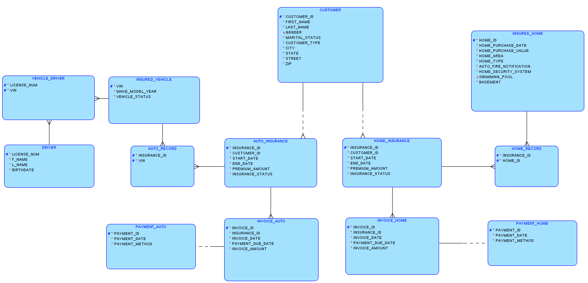
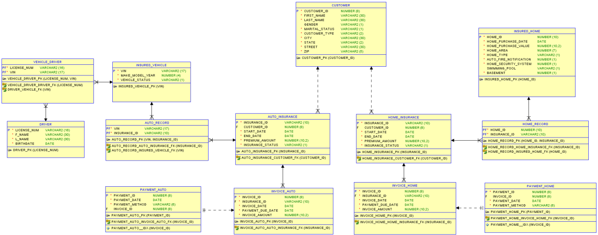

### Description

This design considers facts of insurance mechanism, achieving records of customer personal information and insurance information, also tracking the status of insurance and their insured objects. This design allows tracking multiple current insurances of one customer. More details are in assumptions.

---

### Assumption:

1. Gender is optional (can be NULL) because customer can choose not to provide gender data.
2. A customer can have multiple insurances for different types, time periods, insured objects; also, a customer can have one or two insurance type. Thus customers’ relationship with each type of insurance is mandatory one to optional many, and INSURANCE_ID for different types, time periods are different.
3. For customer type, it can be auto or home or both. We use “A” represents Automobile Insurance customer and “H” represents Home insurance customer, ”B” represents both. By customer type, we can write view to check one or both types of insurance. If one has both types of insurance record but one type is expired, it will not be considered as “B”.
4. A home insurance or auto insurance can have one or multiple insured objects so their relationships are both one to many.
5. A vehicle is corresponding to multiple drivers and a driver is possible to drive multiple vehicles in for different insurances, thus INSURED_VEHICLE has many-to-many relationship with DRIVER.
6. A customer can pay premium by installments and this is implemented by having multiple invoices, each invoice is corresponding to only one payment, it is like pay an assigned part of premium for each month. So INSURANCE entity has one-to-many relationship with INVOICE and INVOICE’s relationship with PAYMENT is one to optional one. One invoice must only be generated after due of last invoice if paid by installments

---

### Logic Model

---

### Relational Model

